Vue 3.0 + Vite 2.0 + Vue-Router 4.0 + Element-Plus + Echarts 5.0 + Axios 后台管理系统。


包含数据面板、轮播图管理、商品管理、订单管理、会员管理、分类管理、设置等模块。

主要仿照新蜂商城：

- [新蜂商城后端接口 newbee-mall-api](https://github.com/newbee-ltd/newbee-mall-api)
- [新蜂商城后台管理系统 Vue3 版本 vue3-admin](https://github.com/newbee-ltd/vue3-admin)

# 启动项目

克隆代码：

```
git clone https://github.com/OweQian/wang-admin.git
```

下载并进入项目，安装 npm 包：

```
cd xxx
yarn
```

启动项目：

```
yarn dev
```

# 目录介绍

* config：存放环境变量相关的路径参数，以及一些配置选项，如图片上传接口等。
* public：存放公共资源静态文件。
* src
    * components：公用组件。
    * router：路由配置项。
    * utils：工具类文件夹，包括请求库的封装，以及一些工具函数的抽离。
    * views：所有的页面组件，都放于此文件夹中。
* element-variables.scss：Element-plus 插件自动生成的 sass 样式文件。
* index.html：入口模板页。
* vite.config.js：Vite 配置文件，内置各类配置项。

# 功能介绍

## 首页

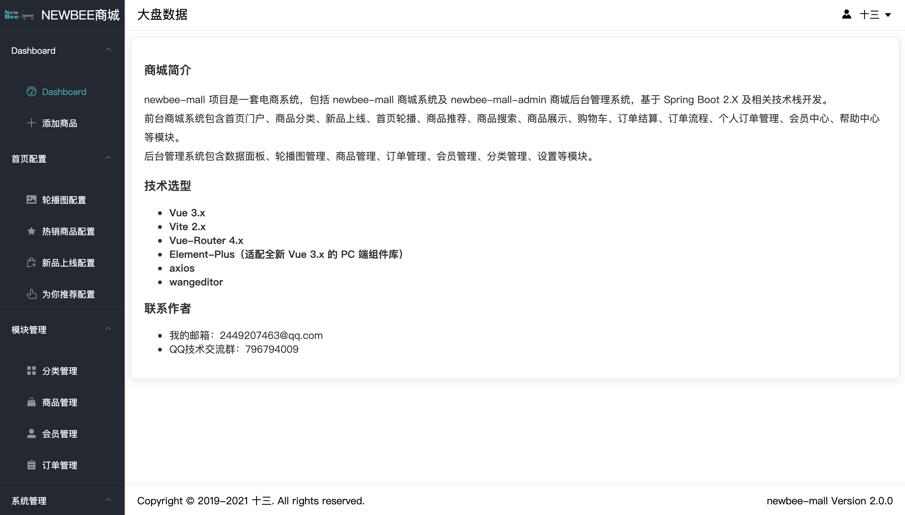

通过 Echarts 可视化图表插件，为大家展示订单的数量、状态以及用户的注册量、日活等信息。

## 轮播图配置

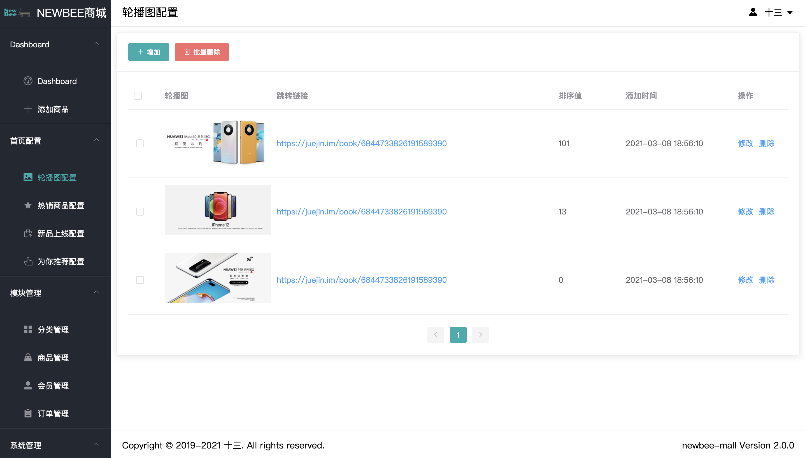

以 Table 列表为主，支持 CheckBox 多选批量删除操作，点击修改，可以单独修改当前轮播图的信息.

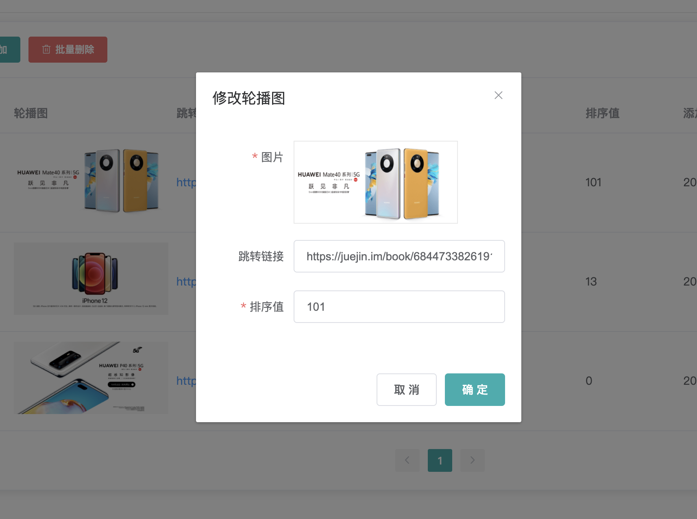

弹窗内的表单，使用 el-form 做表单验证，弹窗则使用了 el-dialog 组件。

## 热销商品配置、新品上线配置、为你推荐配置

通过监听路由的变化，动态的改变接口地址，达到浏览器地址路径变化，视图能跟着变化。

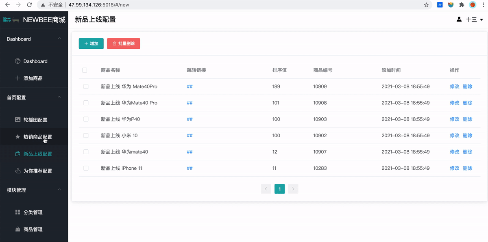

通过切换左边栏的目录来改变浏览器地址栏的路径，从而触发路由监听事件，改变视图的数据。

## 分类管理

分类管理有三级，是用来配置添加商品时，需要设置的商品分类，涉及到三级联动的需求。所以这里分类有一级分类、二级分类、三级分类，并且这三级分类页面功能类似，可以采取合并同类的形式。

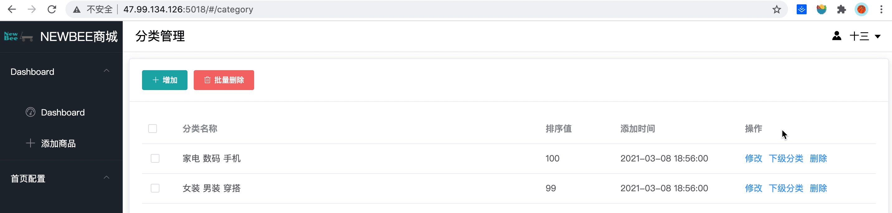

浏览器地址通过 level 参数的变化，来控制级别的变化。

## 商品管理

商品的新增和编辑用到了三级联动、表单验证、输入框、单选框、图片上传、富文本编辑等等知识点。

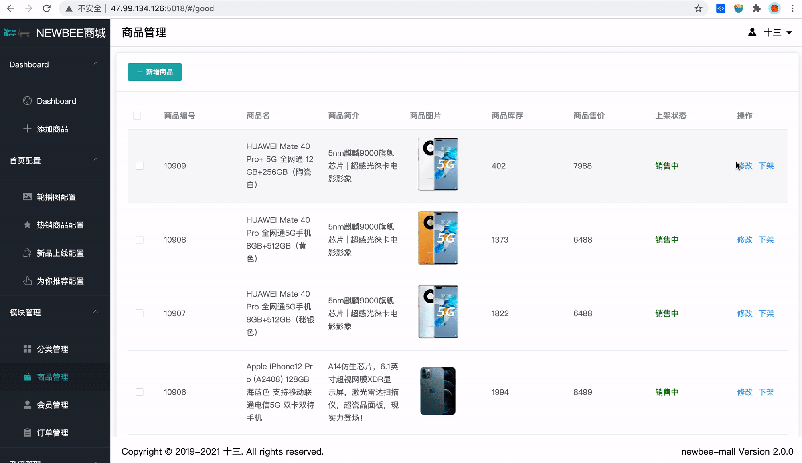

## 会员管理

会员管理，也就是管理 C 端登录注册的用户，通过是否禁来限制用户。

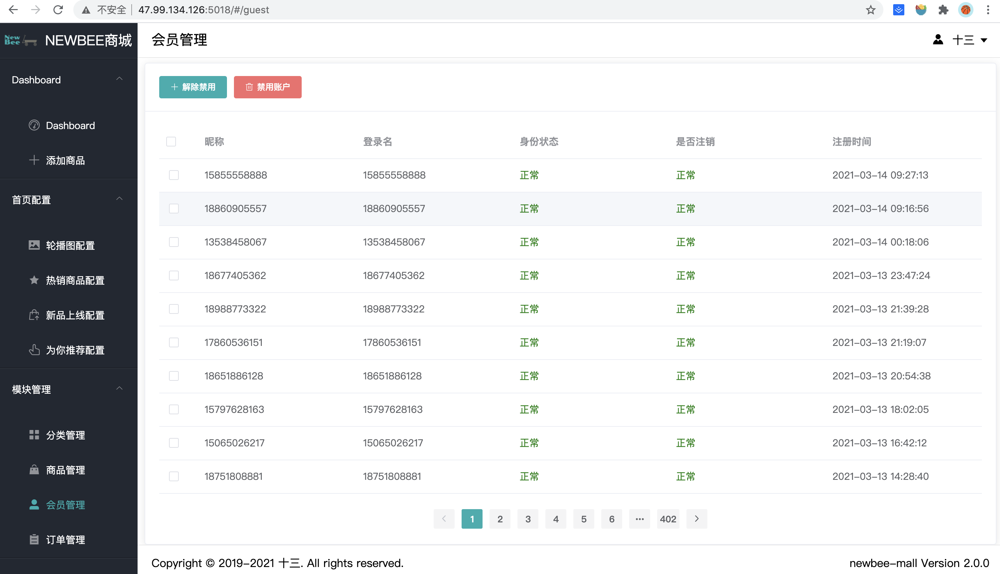

## 订单管理

涉及到配货、出库、订单状态的变更、关闭、详情等内容。并且配有条件筛选项，可通过订单号、订单状态，过滤出你想要的订单。

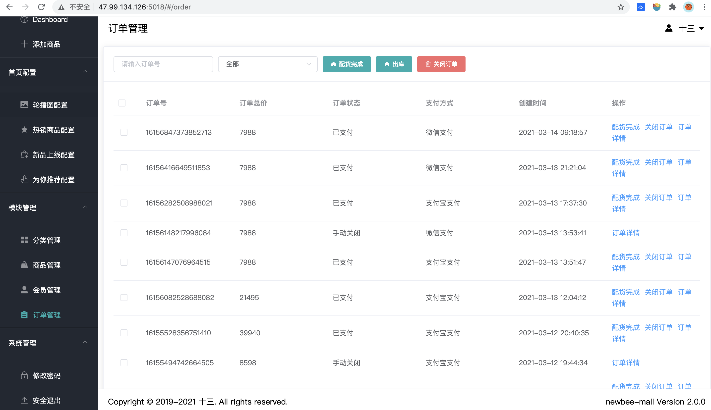

## 修改密码

涉及到管理员的个人昵称和密码以及登录名的修改。

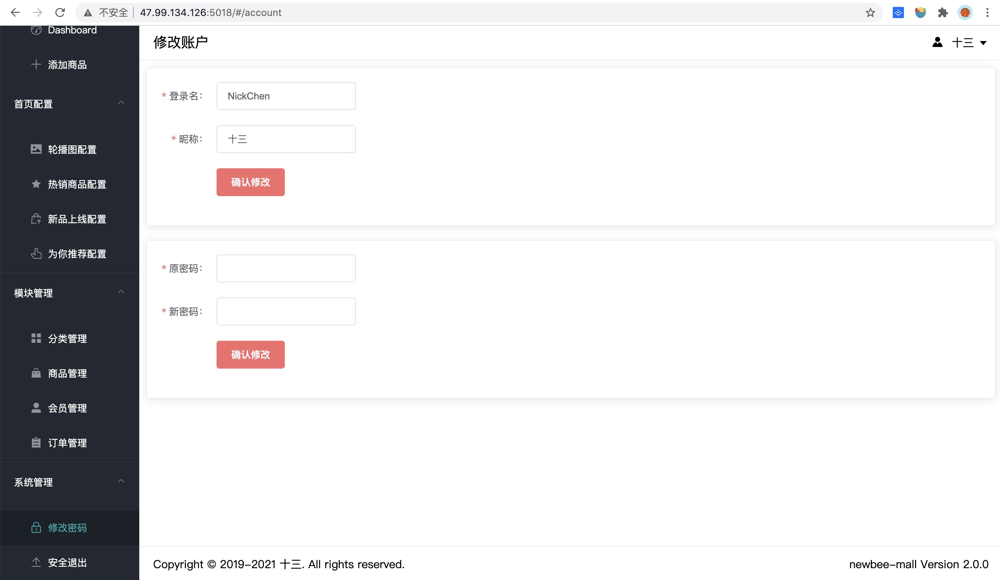

## 个人信息

通过 element-plus 的 el-popover 组件实现，内部采用插槽的形式完成。

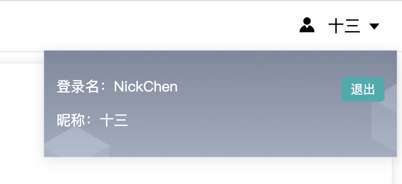

## 其他

整个项目的布局采用如下形式：

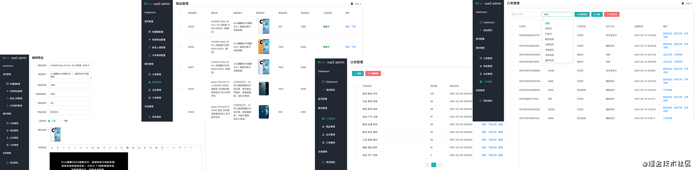

左边栏固定，右边栏自适应。右边栏上下头尾采用公共组件的形式，抽离在 components 中，中间的 content 部分设置最大高度，超过最大高度则自动出现滚动条。